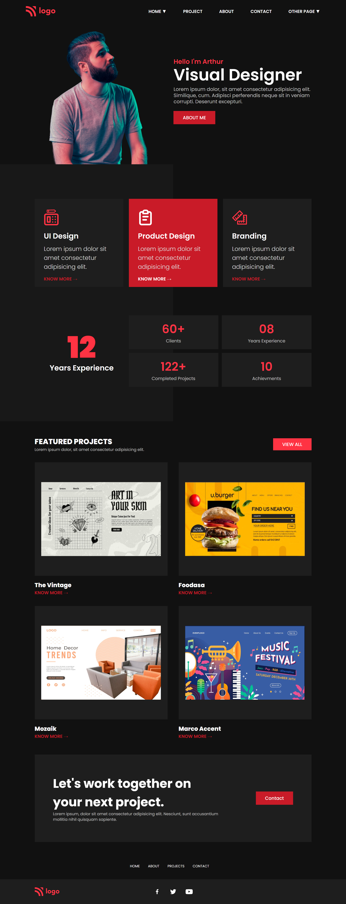

## 🔗Project 15 Link

 
# ✨ Project 15 : Product Design Landing Page ✨

This assignment is written in **HTML5 and CSS3** which is given in **"JavaScript Full Stack Web Developer Bootcamp"** by **iNeuron**.

 

 

 

## 📌 Screenshot

 

 

## 📌 What I Learn

    👉 Structuring HTML and CSS.
    👉 Various CSS Selectors etc.
    👉 Flexbox in CSS.
    👉 CSS Positions.
    👉 How to use SVG images.

## I took 6 hours to build this project and 5 hours to make it responsive and I really enjoyed it 😊.

## 💬 Connect With Me

- **Email** - sainianjali1097@gamil.com
-

## 📌 Acknowledgments

- Course Instructor - [Hitesh Choudhary](https://github.com/hiteshchoudhary)
